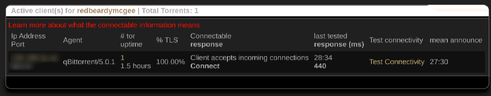

# podbox



## Installation

My proof of concept server running this container stack is built on AlmaLinux
9.4. `podman` and `systemd` with `quadlet` support is required if you are using another
distro.

- Perform `dnf update` immediately

### [Repositories](https://wiki.almalinux.org/repos/)

These may not really be necessary to set up, but you should absolutely review
them and decide for yourself.

- [AlmaLinux](https://wiki.almalinux.org/repos/AlmaLinux.html)
- [CentOS SIGs](https://wiki.almalinux.org/repos/CentOS.html)
- [Extra](https://wiki.almalinux.org/repos/Extras.html)
    - EPEL and CRB
        - `dnf install epel-release`
        - `dnf config-manager --set-enabled crb`
    - ELRepo
        - `dnf install elrepo-release`
    - [RPM Fusion](https://wiki.almalinux.org/documentation/epel-and-rpmfusion.html)

## SSH

SSH is optional, but highly encouraged. Cockpit gives you a terminal too, but
that's nowhere near as good as what you can do with a real terminal emulator
and ssh clients.

```bash
dnf install openssh-server

## Generate strong key on your laptop or workstation/desktop
ssh-keygen -t ed25519 -a 32 -f ~/.ssh/"$localhost-to-$remotehost"

## Copy key to AlmaLinux
ssh-copy-id -i ~/.ssh/"$localhost-to-$remotehost" "$user@$remotehost"
```

### Override `sshd` config

We don't want to allow anyone to login as root remotely ever. You must be a
`sudoer` with public key auth to elevate to root.

```bash
printf '%s\n' 'PermitRootLogin no' > /etc/ssh/sshd_config.d/01-root.conf
printf '%s\n' \
    'PubkeyAuthentication yes' \
    'PasswordAuthentication no' > /etc/ssh/sshd_config.d/01-pubkey.conf
```

## Cockpit -> https://ip-addr:9090

> [!WARNING] Disable the firewall if you are lazy
> Exposing ports for other services can be exhausting and I have not learned
> how to do this for containers properly. Each container may need a new rule
> for something, not sure.
> ```bash
> systemctl disable --now firewalld
> ```

Enable the socket-activated cockpit service and allow it through the firewall.

```bash
systemctl enable --now cockpit.socket

# FIXME: Unnecessary? Default works?
firewall-cmd --permanent --zone=public --add-service=cockpit
firewall-cmd --reload
```

### Add SSH keys

> [!TIP] Skip if you copied your keys with `ssh-copy-id` above.

`Accounts` -> `Your account` -> `Authorized public SSH keys` -> `Add Key`

### Install SELinux troubleshoot tool

This is a component for Cockpit.

```bash
dnf install setroubleshoot-server
```

## Podman

Podman is a daemonless container hypervisor. This document prepares a fully
rootless environment for our containers to run in.

### Install

```bash
dnf install podman
systemctl enable --now podman
```

> [!NOTE] Read the docs
> `man podman-systemd.unit`

### slirp4netns

> [!TODO]
> This may not be necessary but my system is currently using it

```bash
dnf install slirp4netns
```

### Install DNS server for `podman`

> [!TODO]
> Not sure how to resolve these correctly yet but the journal logs it
> so it's running for something

```bash
dnf install aardvark-dns
```

### Enable unprivileged port binding

> [!NOTE] This is only necessary if you are setting up the reverse proxy

```bash
printf '%s\n' 'net.ipv4.ip_unprivileged_port_start=80' > /etc/sysctl.d/99-unprivileged-port-binding.conf
sysctl 'net.ipv4.ip_unprivileged_port_start=80'
```

### Prepare container user

This user will be the owner of all containers with no login shell or root
privileges.

```bash
# Prepare a group id outside of the normal range
groupadd --gid 2000 $ctuser
# Create user with restrictions
# We need the $HOME to live in
useradd --create-home \
    --shell /usr/bin/false \
    --password $ctuser_pw \
    --no-user-group \
    --gid $ctuser \
    --groups systemd-journal \
    --uid 2000 \
    $ctuser
usermod --lock $ctuser # Lock user from password login
# Add container sub-ids
usermod --add-subuids 200000-299999 --add-subgids 200000-299999 $ctuser
# Start $ctuser session at boot without login
loginctl enable-linger $ctuser
```

> [!TIP] Optionally setup ssh keys to directly login to $ctuser

> [!NOTE] The login shell doesn't exist
> Launch `bash -l` manually to get a shell or else your `ssh` will exit with a
> status of 1.

### Setup $ctuser env

```bash
# Switch to user (`-i` doesn't work without a login shell)
sudo -u $ctuser bash -l
# Create dirs
mkdir -p ~/.config/{containers/systemd,environment.d} ~/containers/storage
# Prepare `systemd --user` env
echo 'XDG_RUNTIME_DIR=/run/user/$UID' >> ~/.config/environment.d/10-xdg.conf
# Enable container auto-update
podman system migrate
# WARNING: Set strict versions for all containers or risk catastrophe
systemctl --user enable --now podman-auto-update
exit
```

### ~/.config/containers/systemd/protonvpn.network

This is a small internal network for this stack of containers to share.

```ini
[Unit]
Description=ProtonVPN
After=network-online.target

[Install]
WantedBy=default.target

[Network]
NetworkName=protonvpn
Subnet=172.25.0.0/28
Gateway=172.25.0.1
DNS=1.1.1.1
```

### ~/.config/containers/systemd/gluetun.container

This is our VPN container. This example uses ProtonVPN.

> [!WARNING] I disabled SELinux to not deal with this for every other issue
> /etc/selinux/config -> `SELINUX=disabled`

Temporarily set SELinux policy to allow containers to use devices.

```bash
setsebool -P container_use_devices 1
```

> [!TIP] Get protonvpn user/pass
> [OpenVpnIKEv2](https://account.proton.me/u/0/vpn/OpenVpnIKEv2)

```ini
[Unit]
Description=gluetun VPN
After=protonvpn-network.service
PartOf=protonvpn-network.service

[Service]
Restart=on-failure
TimeoutStartSec=900

[Install]
WantedBy=default.target

[Container]
Image=docker.io/qmcgaw/gluetun:$gluetun_version
ContainerName=gluetun
HostName=gluetun
AutoUpdate=registry
AddCapability=NET_ADMIN
AddDevice=/dev/net/tun:/dev/net/tun

Network=protonvpn

Volume=/volumes/gluetun/auth/config.toml:/gluetun/auth/config.toml

Environment=TZ=$timezone
Environment=UPDATER_PERIOD=24h
Environment=UPDATER_VPN_SERVICE_PROVIDERS=protonvpn
Environment=VPN_SERVICE_PROVIDER=protonvpn
# The trailing `+pmp` is for port forwarding
Environment=OPENVPN_USER=${openvpn_user}+pmp
Environment=OPENVPN_PASSWORD=$openvpn_password
Environment=OPENVPN_CIPHERS=aes-256-gcm
Environment=SERVER_COUNTRIES=$countries
Environment=VPN_PORT_FORWARDING=on
Environment=FIREWALL_DEBUG=on
```

### /volumes/gluetun/auth/config.toml

This allows us to query the `gluetun` API for the forwarded port without
needing an API user and password.

> [!WARNING] Do not expose the API to the internet

```toml
[[roles]]
name = "qbittorrent"
routes = ["GET /v1/openvpn/portforwarded"]
auth = "none"
```

### ~/.config/containers/systemd/qbittorrent.container

> [!NOTE] Check $qbt_version from tags on dockerhub 
> [qbittorrentofficial](https://docker.io/qbittorrentofficial/qbittorrent-nox)

```ini
[Unit]
Description=qbittorrent client
After=gluetun.service
BindsTo=gluetun.service

[Service]
Restart=on-failure
TimeoutStartSec=900

[Install]
WantedBy=default.target

[Container]
Image=docker.io/qbittorrentofficial/qbittorrent-nox:$qbt_version
ContainerName=qbittorrent
HostName=qbittorrent
AutoUpdate=registry

Network=container:gluetun

Volume=/volumes/qbittorrent/config:/config
Volume=/volumes/qbittorrent/downloads:/downloads

Environment=QBT_LEGAL_NOTICE=confirm
Environment=QBT_VERSION=$qbt_version
Environment=TZ=$timezone
```

### ~/.config/containers/systemd/qbittorrent-port-forward.container

This updates the `qbittorrent` configuration to match the forwarded port from
`gluetun`.

> [!TIP] Check the ip address of most containers
> `podman exec -it $container_name ip addr show`

```ini
[Unit]
Description=Port forward updater for qbittorrent over gluetun
After=gluetun.service
After=qbittorrent.service
BindsTo=gluetun.service
BindsTo=qbittorrent.service

[Service]
Restart=on-failure
TimeoutStartSec=900

[Install]
WantedBy=default.target

[Container]
# TODO: Replace this with one that has tags
# Probably have to repack my own
Image=docker.io/mjmeli/qbittorrent-port-forward-gluetun-server:latest
ContainerName=qbittorrent-port-forward
HostName=qbittorrent-port-forward
AutoUpdate=registry

Network=container:gluetun

Environment=QBT_USERNAME=$qbt_user
Environment=QBT_PASSWORD=$qbt_password
Environment=QBT_ADDR=http://localhost:8080
Environment=GTN_ADDR=http://localhost:8000
```

### ~/.config/containers/systemd/seedboxapi.container

This ensures that your torrent session stays in sync with your MAM session.

> [!NOTE] Set your dynamic session with ASN lock now to view the $mam_id

```ini
[Unit]
Description=Update qbittorrent session IP for tracker
After=qbittorrent.service
After=gluetun.service
BindsTo=gluetun.service
BindsTo=qbittorrent.service

[Service]
Restart=on-failure
TimeoutStartSec=900

[Install]
WantedBy=default.target

[Container]
# TODO: Is `latest` safe for this container?
Image=docker.io/myanonamouse/seedboxapi:latest
ContainerName=seedboxapi
HostName=seedboxapi
AutoUpdate=registry

Network=container:gluetun

Volume=/volumes/seedboxapi/config:/config

Environment=DEBUG=1
Environment=mam_id=$mam_id
Environment=interval=1
```

### ~/.config/containers/systemd/pointspend.container

> [!TIP] Optional bonus points spender
> Useful to maintain VIP and not hit max 99999

```ini
[Unit]
Description=Bonus points spender
After=qbittorrent.service
After=gluetun.service
BindsTo=gluetun.service
BindsTo=qbittorrent.service

[Service]
Restart=on-failure
TimeoutStartSec=900

[Install]
WantedBy=default.target

[Container]
# TODO: Is `latest` safe for this container?
Image=docker.io/myanonamouse/pointspend:latest
ContainerName=pointspend
HostName=pointspend
AutoUpdate=registry

Network=container:gluetun

Environment=MAMID=$mam_id
Environment=BUFFER=10000
Environment=WEDGEHOURS=0
Environment=VIP=1
```

### ~/.config/containers/systemd/caddy.container

This is an optional container to add a reverse proxy (and more).

> [!TODO] Needs to be filled out.
> Works as is but doesn't do anything with a default config.

```ini
[Unit]
Description=Reverse proxy
After=protonvpn-network.service

[Service]
Restart=on-failure

[Install]
WantedBy=default.target

[Container]
Image=docker.io/caddy:2
ContainerName=caddy
HostName=caddy

Network=protonvpn
PublishPort=80:80
PublishPort=443:443
PublishPort=443:443/udp

Volume=/volumes/caddy/config:/config
Volume=/volumes/caddy/etc/caddy/Caddyfile:/etc/caddy/Caddyfile
Volume=/volumes/caddy/srv:/srv
Volume=/volumes/caddy/data:/data
```

### /volumes/caddy/etc/caddy/Caddyfile

```
# The Caddyfile is an easy way to configure your Caddy web server.
#
# Unless the file starts with a global options block, the first
# uncommented line is always the address of your site.
#
# To use your own domain name (with automatic HTTPS), first make
# sure your domain's A/AAAA DNS records are properly pointed to
# this machine's public IP, then replace ":80" below with your
# domain name.

:80 {
        # Set this path to your site's directory.
        root * /usr/share/caddy

        # Enable the static file server.
        file_server

        # Another common task is to set up a reverse proxy:
        # reverse_proxy localhost:8080

        # Or serve a PHP site through php-fpm:
        # php_fastcgi localhost:9000
}

# Refer to the Caddy docs for more information:
# https://caddyserver.com/docs/caddyfile
```
